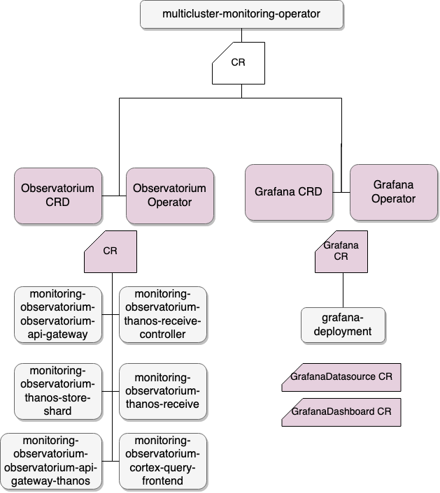

# multicluster-monitoring-operator

## Overview

The multicluster-monitoring-operator is a component of ACM observability feature. It is designed to install into Hub Cluster.

<div align="center">

</div>

## Installation

We provided an easy way to install this operator into KinD cluster to verify some basic functionalities.

1. Clone this repo locally

```
git clone https://github.com/open-cluster-management/multicluster-monitoring-operator.git
```

2. Provide the username and password for downloading multicluster-monitoring-operator image from quay.io.

```
export DOCKER_USER=<quay.io username>
export DOCKER_PASS=<quay.io password>
```

3. Deploy using the ./tests/e2e/setup.sh script
```
./tests/e2e/setup.sh
```
If you want to install the latest multicluster-monitoring-operator image, you can find the latest tag here https://quay.io/repository/open-cluster-management/multicluster-monitoring-operator?tab=tags. Then install by
```
./tests/e2e/setup.sh quay.io/open-cluster-management/multicluster-monitoring-operator:<latest tag>
```

4. Access the grafana dashboard
- Option 1: Edit /etc/hosts to add 
```
127.0.0.1 grafana.local
```
Then access grafana dashboard by `http://grafana.local`
- Option 2: Forward the grafana port into local machine
```
kubectl port-forward -n open-cluster-management $(oc get pod -n open-cluster-management -lapp=grafana-test -o jsonpath='{.items[0].metadata.name}') 3001
```
Then access grafana dashboard by `http://127.0.0.1:3001`

## Developer Guide
The guide is used for developer to build and install the multicluster-monitoring-operator. It can be running in [kind][install_kind] if you don't have a OCP environment.

### Prerequisites

- [git][git_tool]
- [go][go_tool] version v1.13.9+.
- [docker][docker_tool] version 19.03+.
- [kubectl][kubectl_tool] version v1.14+.
- Access to a Kubernetes v1.11.3+ cluster.

### Install the Operator SDK CLI

Follow the steps in the [installation guide][install_guide] to learn how to install the Operator SDK CLI tool. It requires [version v0.17.0][operator_sdk_v0.17.0].
Or just use this command to download `operator-sdk` for Mac:
```
curl -L https://github.com/operator-framework/operator-sdk/releases/download/v0.17.0/operator-sdk-v0.17.0-x86_64-apple-darwin -o operator-sdk
```

### Build the Operator

- git clone this repository.
- `go mod vendor`
- `operator-sdk build <repo>/<component>:<tag>` for example: quay.io/multicluster-monitoring-operator:v0.1.0.
- Replace the image in `deploy/operator.yaml`.
- Update your namespace in `deploy/role_binding.yaml`
- Update your grafana.server.domain in `deploy/crds/monitoring.open-cluster-management.io_v1_multiclustermonitoring_cr.yaml`

### Deploy this Operator

1. If you are using aws environment, skip this step. the `StorageClass` is set as `gp2` by default. Prepare the `StorageClass` and `PersistentVolume` to apply into the existing environment. For example:
```
kind: StorageClass
apiVersion: storage.k8s.io/v1
metadata:
  annotations:
    storageclass.kubernetes.io/is-default-class: "true"
  name: standard
provisioner: kubernetes.io/no-provisioner
---
apiVersion: v1
kind: PersistentVolume
metadata:
  name: pv-volume-1
  labels:
    type: local
spec:
  storageClassName: standard
  capacity:
    storage: 1Gi
  accessModes:
    - ReadWriteOnce
  persistentVolumeReclaimPolicy: Delete
  hostPath:
    path: "/mnt/thanos/teamcitydata1"
```
2. Apply the manifests
```
kubectl apply -f deploy/req_crds/
kubectl apply -f deploy/crds/
kubectl apply -f deploy/

```
After installed successfully, you will see the following output:
`oc get pod`
```
NAME                                                              READY   STATUS    RESTARTS   AGE
grafana-deployment-846fd485fc-pmg6x                               1/1     Running   0          158m
grafana-operator-6fd7d76c6c-lzp6d                                 1/1     Running   0          158m
minio-5c8b47c889-vvfrz                                            1/1     Running   0          158m
monitoring-observatorium-cortex-query-frontend-5644474746-2tpsv   1/1     Running   0          158m
monitoring-observatorium-observatorium-api-gateway-6c4c475f4d5x   1/1     Running   0          158m
monitoring-observatorium-observatorium-api-gateway-thanos-vp2vm   1/1     Running   0          158m
monitoring-observatorium-thanos-compact-0                         1/1     Running   0          158m
monitoring-observatorium-thanos-query-698f99987f-xlndd            1/1     Running   0          158m
monitoring-observatorium-thanos-receive-controller-f5554fb9lnbj   1/1     Running   0          158m
monitoring-observatorium-thanos-receive-default-0                 1/1     Running   0          158m
monitoring-observatorium-thanos-receive-default-1                 1/1     Running   0          157m
monitoring-observatorium-thanos-receive-default-2                 1/1     Running   0          156m
monitoring-observatorium-thanos-rule-0                            1/1     Running   0          158m
monitoring-observatorium-thanos-rule-1                            1/1     Running   0          156m
monitoring-observatorium-thanos-store-shard-0-0                   1/1     Running   0          158m
multicluster-monitoring-operator-5d7fd6dffb-qgg6c                 1/1     Running   0          158m
observatorium-operator-84787d4b9c-28pd9                           1/1     Running   0          158m
```
`oc get grafana`
```
NAME                 AGE
monitoring-grafana   165m
```
`oc get observatorium`
```
NAME                       AGE
monitoring-observatorium   163m
```
### View metrics in dashboard
1. The Prometheus in hub cluster already enabled remoteWrite to send metrics. Access Grafana console at https://{YOUR_DOMAIN}/grafana, view the metrics in the dashboard named "ACM:Managed Cluster Monitoring"

2. Enable remote write for OCP prometheus in spoke clusters
Create the configmap in openshift-monitoring namespace. Replace the url with the your route value. Also need to replace the value of "replacement" with the spoke cluster's name
```
apiVersion: v1
kind: ConfigMap
metadata:
  name: cluster-monitoring-config
  namespace: openshift-monitoring
data:
  config.yaml: |
    prometheusK8s:
      remoteWrite:
        - url: "http://observatorium-api-gateway-acm-monitoring.apps.one-chimp.dev05.red-chesterfield.com/api/metrics/v1/write"
          writeRelabelConfigs:
          - sourceLabels: [__name__]
            replacement: test_cluster
            targetLabel: cluster_name
```
The changes will be applied automatically after several minutes. You can apply the changes immediately by invoking command below
```
oc scale --replicas=2 statefulset --all -n openshift-monitoring; oc scale --replicas=1 deployment --all -n openshift-monitoring
```

[install_kind]: https://github.com/kubernetes-sigs/kind
[install_guide]: https://github.com/operator-framework/operator-sdk/blob/master/doc/user/install-operator-sdk.md
[git_tool]:https://git-scm.com/downloads
[go_tool]:https://golang.org/dl/
[docker_tool]:https://docs.docker.com/install/
[kubectl_tool]:https://kubernetes.io/docs/tasks/tools/install-kubectl/
[operator_sdk_v0.17.0]:https://github.com/operator-framework/operator-sdk/releases/tag/v0.17.0
