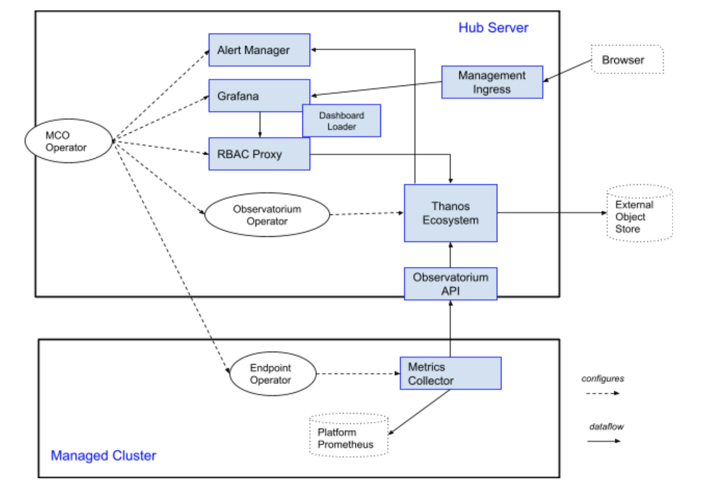

# Observability Overview

[](https://prow.ci.openshift.org/?repo=open-cluster-management%2F${multicluster-observability-operator})
[](https://sonarcloud.io/dashboard?id=open-cluster-management_multicluster-observability-operator)


This document attempts to explain how the different components in Open Cluster Management Observabilty come together to deliver multicluster fleet observability. We do leverage several open source projects: [Grafana](https://github.com/grafana/grafana), [Alertmanager](https://github.com/prometheus/alertmanager), [Thanos](https://github.com/thanos-io/thanos/), [Observatorium Operator and API Gateway](https://github.com/observatorium), [Prometheus](https://github.com/prometheus/prometheus); We also leverage a few [Open Cluster Mangement projects](https://open-cluster-management.io/) namely - [Cluster Manager or Registration Operator](https://github.com/open-cluster-management/registration-operator), [Klusterlet](https://github.com/open-cluster-management/registration-operator). The multicluster-observability operator is the root operator which pulls in all things needed.

## Conceptual Diagram



## Associated Github Repositories

Component |Git Repo	| Description	
---  | ------ | ----  
MCO Operator | [multicluster-observability-operator](https://github.com/open-cluster-management/multicluster-observability-operator) | Operator for monitoring. This is the root repo. If we follow the Readme instructions here to install, the code from all other repos mentioned below are used/referenced.
Endpoint Operator | [endpoint-metrics-operator](https://github.com/open-cluster-management/multicluster-observability-operator/tree/main/operators/endpointmetrics) | Operator that manages  setting up observability and data collection at the managed clusters.
Observatorium Operator | [observatorium-operator](https://github.com/open-cluster-management/observatorium-operator) | Operator to deploy the Observatorium project. Inside the open cluster management, at this time, it means metrics using Thanos. Forked from main observatorium-operator repo.
Metrics collector | [metrics-collector](https://github.com/open-cluster-management/multicluster-observability-operator/tree/main/collectors/metrics) | Scrapes metrics from Prometheus at managed clusters, the metric collection being shaped by configuring allow-list. 
RBAC Proxy | [rbac_query_proxy](https://github.com/open-cluster-management/multicluster-observability-operator/tree/main/proxy) | Helper service that acts a multicluster metrics RBAC proxy.
Grafana | [grafana](https://github.com/open-cluster-management/grafana) | Grafana repo -  for  dashboarding and metric analytics. Forked from main grafana repo.
Dashboard Loader | [grafana-dashboard-loader](https://github.com/open-cluster-management/multicluster-observability-operator/tree/main/loaders/dashboards) | Sidecar proxy to load grafana dashboards from configmaps. 
Management Ingress | [management-ingress](https://github.com/open-cluster-management/management-ingress) | NGINX based ingress controller to serve Open Cluster Management services. 
Observatorium API | [observatorium](https://github.com/open-cluster-management/observatorium) | API Gateway which controls reading, writing of the Observability data to the backend infrastructure. Forked from main observatorium API repo.
Thanos Ecosystem | [kube-thanos](https://github.com/open-cluster-management/kube-thanos) | Kubernetes specific configuration for deploying Thanos. The observatorium operator leverages this configuration to deploy the backend Thanos components.

## Quick Start Guide

### Prerequisites

* Ensure [kubectl](https://kubernetes.io/docs/tasks/tools/install-kubectl) and [kustomize](https://kubernetes-sigs.github.io/kustomize/installation) are installed.
* Prepare a OpenShift cluster to function as the hub cluster.
* Ensure [docker 17.03+](https://docs.docker.com/get-started) is installed.
* Ensure [golang 1.15+](https://golang.org/doc/install) is installed.
* Ensure [operator-sdk 1.4.2+](https://github.com/operator-framework/operator-sdk) in installed.
* Ensure the open-cluster-management cluster manager is installed. See [Cluster Manager](https://open-cluster-management.io/getting-started/core/cluster-manager/) for more information.
* Ensure the `open-cluster-management` _klusterlet_ is installed. See [Klusterlet](https://open-cluster-management.io/getting-started/core/register-cluster/) for more information.

> Note: By default, the API conversion webhook use on the OpenShift service serving certificate feature to manage the certificate, you can replace it with cert-manager if you want to run the multicluster-observability-operator in a kubernetes cluster.

Use the following quick start commands for building and testing the multicluster-observability-operator:

### Clone the Repository

Check out the multicluster-observability-operator repository.

```
git clone git@github.com:open-cluster-management/multicluster-observability-operator.git
cd multicluster-observability-operator
```

### Build the Operator

Build the multicluster-observability-operator image and push it to a public registry, such as quay.io:

```
make docker-build docker-push IMG=quay.io/<YOUR_USERNAME_IN_QUAY>/multicluster-observability-operator:latest
```

### Run the Operator in the Cluster

1. Create the `open-cluster-management-observability` namespace if it doesn't exist:
```
kubectl create ns open-cluster-management-observability
```

2. Deploy the minio service which acts as storage service of the multicluster observability:
```
kubectl -n open-cluster-management-observability apply -k examples/minio
```

3. Replace the operator image and deploy the multicluster-observability-operator:
```
make deploy IMG=quay.io/<YOUR_USERNAME_IN_QUAY>/multicluster-observability-operator:latest
```

4. Deploy the multicluster-observability-operator CR:
```
kubectl apply -f operators/multiclusterobservability/config/samples/observability_v1beta2_multiclusterobservability.yaml
```

5. Verify all the components for the Multicluster Observability are starting up and runing:
```
kubectl -n open-cluster-management-observability get pod
NAME                                                       READY   STATUS    RESTARTS   AGE
minio-79c7ff488d-72h65                                     1/1     Running   0          9m38s
observability-alertmanager-0                               3/3     Running   0          7m17s
observability-alertmanager-1                               3/3     Running   0          6m36s
observability-alertmanager-2                               3/3     Running   0          6m18s
observability-grafana-85fdc8c48d-j67j6                     2/2     Running   0          7m17s
observability-grafana-85fdc8c48d-wnltt                     2/2     Running   0          7m17s
observability-observatorium-api-69cfff4c95-bpw5s           1/1     Running   0          7m2s
observability-observatorium-api-69cfff4c95-gbh7b           1/1     Running   0          7m2s
observability-observatorium-operator-5df6b7949c-kbpmp      1/1     Running   0          7m17s
observability-rbac-query-proxy-d44df47c4-9ccdn             2/2     Running   0          7m15s
observability-rbac-query-proxy-d44df47c4-rtcgh             2/2     Running   0          6m50s
observability-thanos-compact-0                             1/1     Running   0          7m2s
observability-thanos-query-79c4d9488b-bd5sf                1/1     Running   0          7m3s
observability-thanos-query-79c4d9488b-d7wzt                1/1     Running   0          7m3s
observability-thanos-query-frontend-6fdb5d4946-rgblb       1/1     Running   0          7m3s
observability-thanos-query-frontend-6fdb5d4946-shsz2       1/1     Running   0          7m3s
observability-thanos-query-frontend-memcached-0            2/2     Running   0          7m3s
observability-thanos-query-frontend-memcached-1            2/2     Running   0          6m37s
observability-thanos-query-frontend-memcached-2            2/2     Running   0          6m33s
observability-thanos-receive-controller-6b446c5576-hj6xl   1/1     Running   0          7m3s
observability-thanos-receive-default-0                     1/1     Running   0          7m2s
observability-thanos-receive-default-1                     1/1     Running   0          6m20s
observability-thanos-receive-default-2                     1/1     Running   0          5m50s
observability-thanos-rule-0                                2/2     Running   0          7m3s
observability-thanos-rule-1                                2/2     Running   0          6m27s
observability-thanos-rule-2                                2/2     Running   0          5m56s
observability-thanos-store-memcached-0                     2/2     Running   0          7m3s
observability-thanos-store-memcached-1                     2/2     Running   0          6m37s
observability-thanos-store-memcached-2                     2/2     Running   0          6m33s
observability-thanos-store-shard-0-0                       1/1     Running   2          7m3s
observability-thanos-store-shard-1-0                       1/1     Running   2          7m3s
observability-thanos-store-shard-2-0                       1/1     Running   2          7m3s
```

### What is next

After a successful deployment, you can run the following command to check if you have OCP cluster as a managed cluster.

```
kubectl get managedcluster --show-labels
```
If there is no `vendor=OpenShift` label exists in your managed cluster, you can manually add this label with this command `kubectl label managedcluster <managed cluster name> vendor=OpenShift`

Then you should be able to have `metrics-collector` pod is running:
```
kubectl -n open-cluster-management-addon-observability get pod
endpoint-observability-operator-5c95cb9df9-4cphg   1/1     Running   0          97m
metrics-collector-deployment-6c7c8f9447-brpjj      1/1     Running   0          96m
```

Expose the thanos query frontend via route by running this command:
```
cat << EOF | kubectl -n open-cluster-management-observability apply -f -
kind: Route
apiVersion: route.openshift.io/v1
metadata:
  name: query-frontend
spec:
  port:
    targetPort: http
  wildcardPolicy: None
  to:
    kind: Service
    name: observability-thanos-query-frontend
EOF
```
You can access the thanos query UI via browser by inputting the host from `oc get route -n open-cluster-management-observability query-frontend`. There should have metrics available when you search the metrics `:node_memory_MemAvailable_bytes:sum`. The available metrics are listed [here](https://github.com/open-cluster-management/multicluster-observability-operator/blob/main/operators/multiclusterobservability/manifests/base/config/metrics_allowlist.yaml)

### Uninstall the Operator in the Cluster

1. Delete the multicluster-observability-operator CR:

```
kubectl -n open-cluster-management-observability delete -f operators/multiclusterobservability/config/samples/observability_v1beta2_multiclusterobservability.yaml
```

2. Delete the multicluster-observability-operator:

```
make undeploy
```

3. Delete the minio service:

```
kubectl -n open-cluster-management-observability delete -k examples/minio
```

4. Delete the `open-cluster-management-observability` namespace:

```
kubectl delete ns open-cluster-management-observability
```
