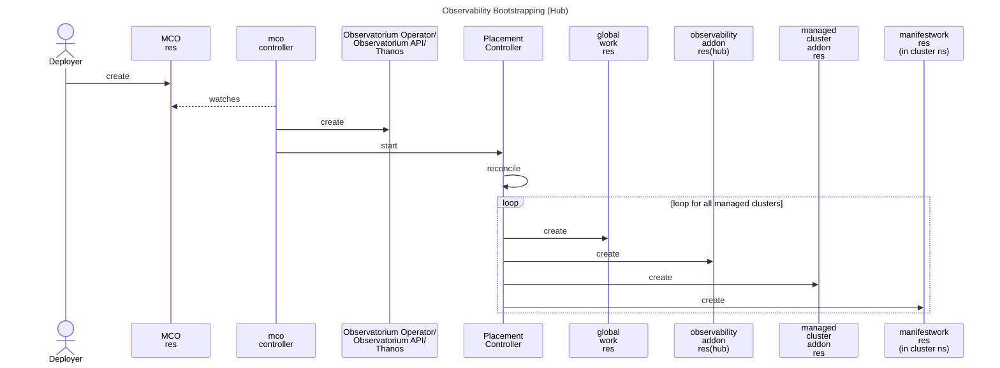

```mermaid
sequenceDiagram
    title Observability Bootstrapping (Hub)

    actor dep as Deployer
    participant mco as MCO<br/>res
    participant mcoctrl as mco<br/>controller
    participant obsthanos as Observatorium Operator/<br/>Observatorium API/<br/>Thanos
    participant plctrl as Placement<br/>Controller
    participant gwr as global<br/>work<br/>res
    participant obsaddon as observability<br/>addon<br/>res(hub)
    participant maddon as managed<br/>cluster<br/>addon<br/>res
    participant mwork as manifestwork<br/>res<br/>(in cluster ns)

    dep->>mco: create
    mcoctrl-->>mco: watches
    mcoctrl->>obsthanos: create
    mcoctrl->>plctrl: start
    plctrl->>plctrl: reconcile
    
    loop loop for all managed clusters
        plctrl->>gwr: create
        plctrl->>obsaddon: create
        plctrl->>maddon: create
        plctrl->>mwork: create
    end
```
