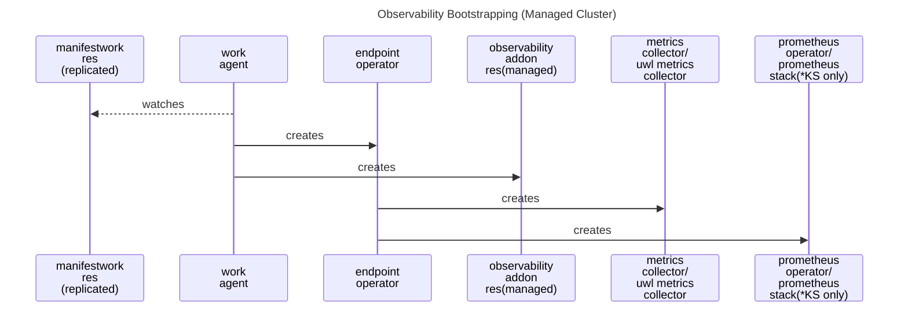

```mermaid
sequenceDiagram
    title Observability Bootstrapping (Managed Cluster)

    participant mwork as manifestwork<br/>res<br/>(replicated)
    participant wagnt as work<br/>agent
    participant ep as endpoint<br/>operator
    participant oman as observability<br/>addon<br/>res(managed)
    participant mcol as metrics<br/>collector/<br/>uwl metrics<br/>collector
    participant prom as prometheus<br/>operator/<br/>prometheus<br/>stack(*KS only)

    wagnt-->>mwork: watches
    wagnt->>ep: creates
    wagnt->>oman: creates
    ep->>mcol: creates
    ep->>prom: creates
```
