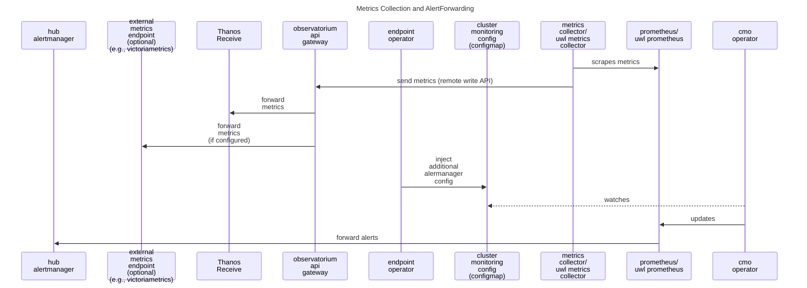

```mermaid
sequenceDiagram
    title Metrics Collection and AlertForwarding

    participant halrt as hub<br/>alertmanager
    participant ext as external<br/>metrics<br/>endpoint<br/>(optional)<br/>(e.g., victoriametrics)
    participant rec as Thanos<br/>Receive
    participant gw as observatorium<br/>api<br/>gateway
    participant ep as endpoint<br/>operator
    participant cmc as cluster<br/>monitoring<br/>config<br/>(configmap)
    participant mcol as metrics<br/>collector/<br/>uwl metrics<br/>collector
    participant prom as prometheus/<br/>uwl prometheus
    participant cmo as cmo<br/>operator

    mcol->>prom: scrapes metrics
    mcol->>gw: send metrics (remote write API)
    gw->>rec: forward<br/>metrics
    gw->>ext: forward<br/>metrics<br/>(if configured)
    ep->>cmc: inject<br/>additional<br/>alermanager<br/>config
    cmo-->>cmc: watches
    cmo->>prom: updates
    prom->>halrt: forward alerts
```
