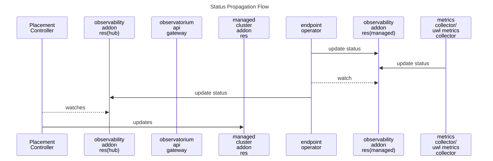

```mermaid
sequenceDiagram
    title Status Propagation Flow

    participant plctrl as Placement<br/>Controller
    participant obsaddon as observability<br/>addon<br/>res(hub)
    participant gw as observatorium<br/>api<br/>gateway
    participant maddon as managed<br/>cluster<br/>addon<br/>res
    participant ep as endpoint<br/>operator
    participant oman as observability<br/>addon<br/>res(managed)
    participant mcol as metrics<br/>collector/<br/>uwl metrics<br/>collector

    ep->>oman: update status
    mcol->>oman: update status
    ep-->>oman: watch
    ep->>obsaddon: update status
    plctrl-->>obsaddon: watches
    plctrl->>maddon: updates
```
