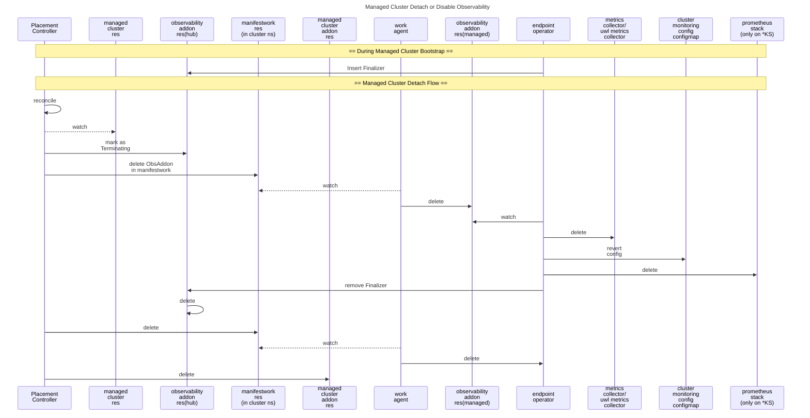

```mermaid
sequenceDiagram
    title Managed Cluster Detach or Disable Observability

    participant plctrl as Placement<br/>Controller
    participant mcl as managed<br/>cluster<br/>res
    participant obsaddon as observability<br/>addon<br/>res(hub)
    participant mwork as manifestwork<br/>res<br/>(in cluster ns)
    participant maddon as managed<br/>cluster<br/>addon<br/>res
    participant wagnt as work<br/>agent
    participant oman as observability<br/>addon<br/>res(managed)
    participant ep as endpoint<br/>operator
    participant mcol as metrics<br/>collector/<br/>uwl metrics<br/>collector
    participant cmc as cluster<br/>monitoring<br/>config<br/>configmap
    participant prom as prometheus<br/>stack<br/>(only on *KS)

    note over plctrl,prom: == During Managed Cluster Bootstrap ==
    
    ep->>obsaddon: Insert Finalizer

    note over plctrl,prom: == Managed Cluster Detach Flow ==

    plctrl->>plctrl: reconcile
    plctrl-->>mcl: watch
    plctrl->>obsaddon: mark as<br/>Terminating
    plctrl->>mwork: delete ObsAddon<br/>in manifestwork
    wagnt-->>mwork: watch
    wagnt->>oman: delete
    ep->>oman: watch
    ep->>mcol: delete
    ep->>cmc: revert<br/>config
    ep->>prom: delete
    ep->>obsaddon: remove Finalizer
    obsaddon->>obsaddon: delete
    plctrl->>mwork: delete
    wagnt-->>mwork: watch
    wagnt->>ep: delete
    plctrl->>maddon: delete
```
