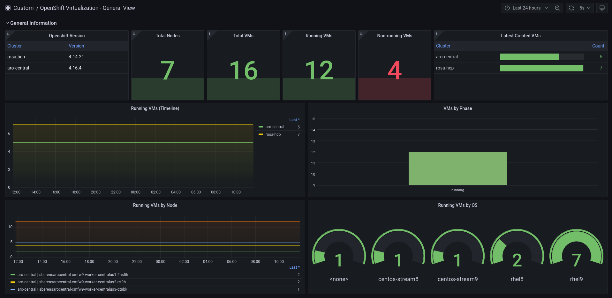
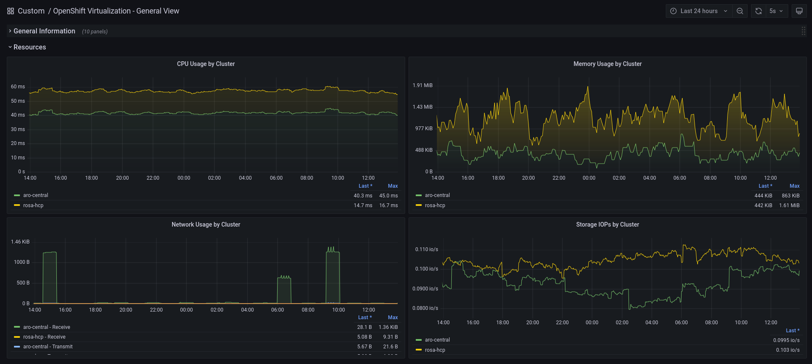
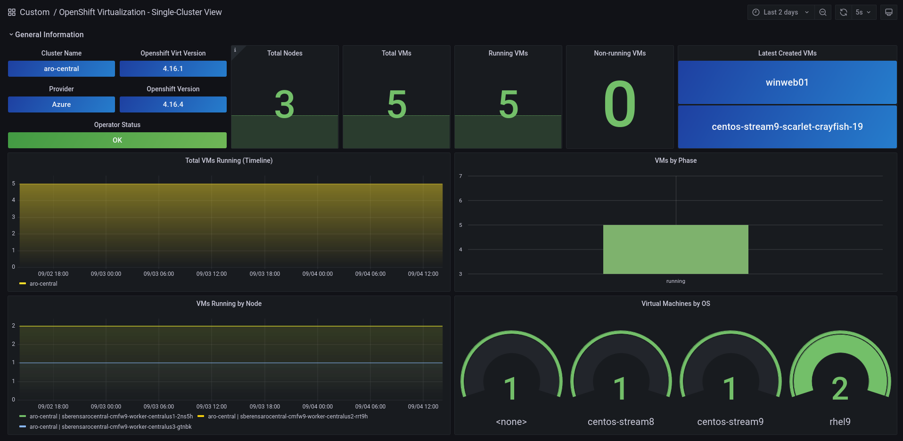
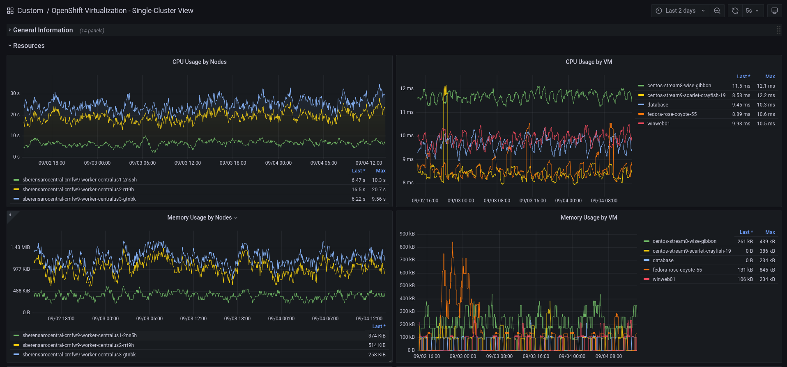
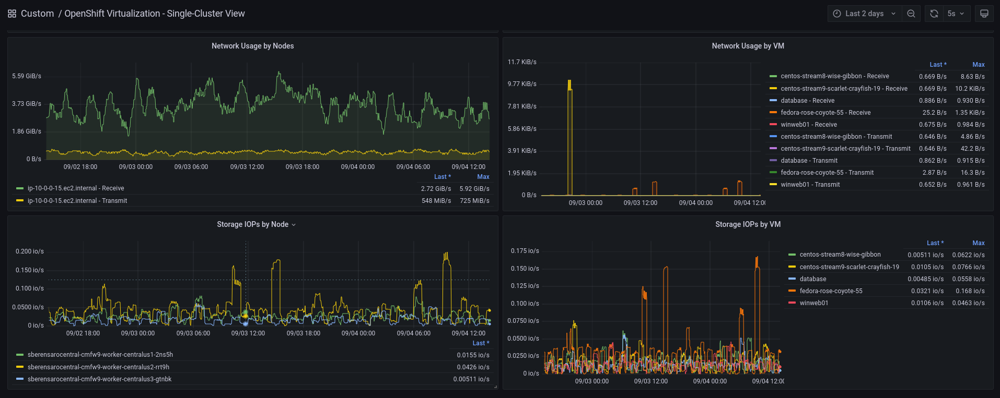
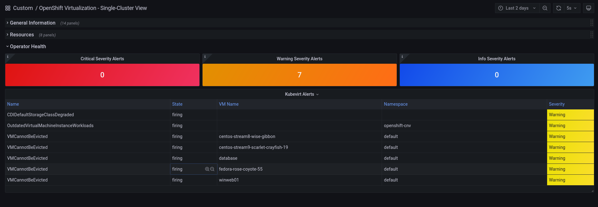

# RHACM Openshift Virtualization - Dashboards

- To install this dashboard on Grafana

```shell
oc create -f acm-ocp-v-metrics-list.yaml
oc create -f acm-ocp-v-general-dashboard.yaml
oc create -f acm-ocp-v-single-cluster-dashboard.yaml
```

- Main metrics used in these dashboards

```yaml
ALERTS
csv_succeeded
acm_managed_cluster_labels
container_start_time_seconds
cnv:vmi_status_running:count
instance:node_cpu_utilisation:rate1m
instance:node_memory_utilisation:ratio
instance:node_network_receive_bytes_excluding_lo:rate1m
instance:node_network_transmit_bytes_excluding_lo:rate1m
kube_node_status_allocatable
kubevirt_vmi_phase_count
kubevirt_vmi_memory_used_bytes
kubevirt_vm_running_status_last_transition_timestamp_seconds
kubevirt_vm_error_status_last_transition_timestamp_seconds
kubevirt_vm_starting_status_last_transition_timestamp_seconds
kubevirt_vm_migrating_status_last_transition_timestamp_seconds
kubevirt_vm_non_running_status_last_transition_timestamp_seconds
kubevirt_hyperconverged_operator_health_status
kubevirt_hco_system_health_status
kubevirt_vmi_cpu_user_usage_seconds_total
kubevirt_vmi_cpu_usage_seconds_total
kubevirt_vmi_network_receive_bytes_total
kubevirt_vmi_network_transmit_bytes_total
kubevirt_vmi_storage_iops_read_total
kubevirt_vmi_storage_iops_write_total
```

<details>
<summary>ACM OCP-V General View Dashboard</summary>

<br>

The General View dashboard is focused on displaying all aggregated information from all clusters running OpenShift Virtualization within the RHACM management fleet.

<br>






</details>

<details>
<summary>ACM OCP-V Single Cluster View Dashboard</summary>

<br>

The OpenShift Single-Cluster View dashboard is focused on detailed visualizations in a specific Openshift Virtualization cluster.

<br>










</details>


