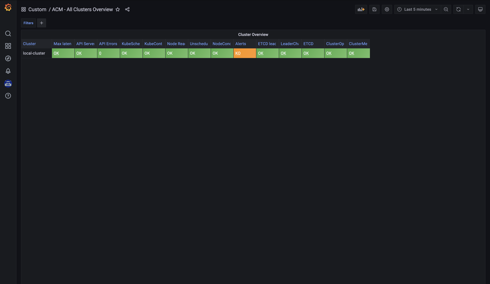
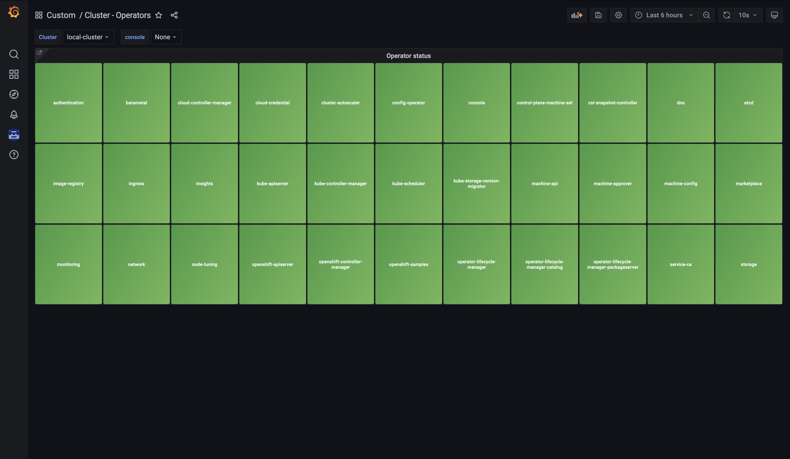

# Custom Overview Dashboard

- To install these dashboard on Grafana

```shell
oc create -f cluster_overview.yaml
oc create -f operator_overview.yaml
```

<details>
<summary>ACM - All Cluster Overview</summary>

Overview dashboards for all clusters in the managed cluster fleet, managed by ACM.



#### Main metrics used in this dashboard

```yaml
- :node_memory_MemAvailable_bytes:sum
- ALERTS
- apiserver_request_duration_seconds:histogram_quantile_99
- cluster_operator_conditions
- etcd_server_has_leader
- etcd_server_leader_changes_seen_total
- kube_node_status_allocatable
- kube_node_status_condition
- kube_node_spec_unschedulable
- sum:apiserver_request_total:1h
- up
```

</details>

<details>
<summary>Cluster - Operators</summary>

Overview dashboard for operator health status within the managed cluster fleet by ACM.



#### Main metrics used in this dashboard

```yaml
- cluster_operator_conditions
```

</details>
