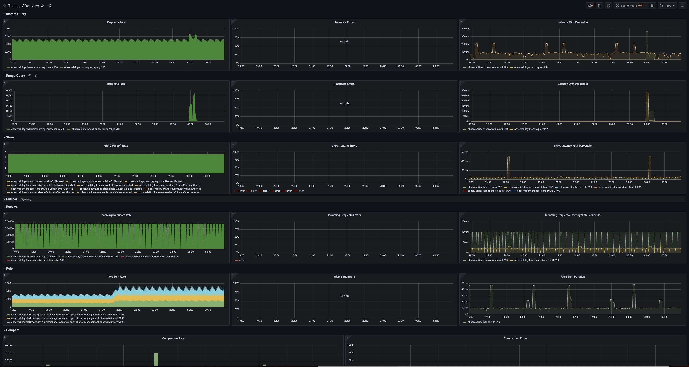

# Setup Thanos Dashboards with ACM Grafana

The Thanos instance bundled with ACM observability publishes metrics that are scraped by OCP Prometheus. The following process describes steps to import community dashboards into a grafana instance
 
## Prepare a Grafana instance

If you plan to use an external Grafana instance, follow steps outlined [in this blog post](https://www.redhat.com/en/blog/)

Alternatively, you can setup a Grafana developer instance and install Thanos dashboards.

### Setup Grafana developer instance

ACM observability allows setting up a  Grafana developer instance `grafana-dev` to deploy your own custom dashboards by following these steps [following these steps](/tools/README.md).

### Configure ACM hub prometheus instance as datasource

1. Grant `grafana-dev` service account `cluster-monitoring-view` cluster role
```
# oc project open-cluster-management-observability
Now using project "open-cluster-management-observability" on server...

# oc adm policy add-cluster-role-to-user cluster-monitoring-view -z grafana-dev
clusterrole.rbac.authorization.k8s.io/cluster-monitoring-view added: "grafana-dev"
```

2. The bearer token for `grafana-dev` service is used to authenticate access to Hub OCP Prometheus in `openshift-monitoring` namespace. Obtain the bearer token to use. Note down the bearer token value.

    For OCP 4.10 and earlier, run:
    ```
    oc serviceaccounts get-token grafana-dev -n open-cluster-management-observability 
    ```

    For OCP 4.11 and later, run:

    ```
    oc create token grafana-dev --duration=8760h -n open-cluster-management-observability
    ```

3. Create a new secret `grafana-dev-datasource` to include Prometheus as a new data source. Replace ${BEARER_TOKEN} with value from step (2).

```
# cat > grafana-dev-datasources.txt<<EOF
apiVersion: 1
datasources:
- access: proxy
  isDefault: true
  name: Observatorium
  type: prometheus
  url: http://rbac-query-proxy.open-cluster-management-observability.svc.cluster.local:8080
  jsonData:
    queryTimeout: 300s
    timeInterval: 300s
- access: proxy
  name: Observatorium-Dynamic
  type: prometheus
  url: http://rbac-query-proxy.open-cluster-management-observability.svc.cluster.local:8080
  jsonData:
    queryTimeout: 300s
    timeInterval: 30s
- access: proxy
  name: Prometheus
  type: prometheus
  url: https://thanos-querier.openshift-monitoring.svc.cluster.local:9091
  jsonData:
    queryTimeout: 300s
    timeInterval: 5s
    tlsSkipVerify: true
    httpHeaderName1: 'Authorization'
  secureJsonData:
    httpHeaderValue1: 'Bearer {BEARER_TOKEN}'
EOF

# oc create secret generic grafana-dev-datasources --from-file=datasources.yaml=./grafana-dev-datasources.txt -n open-cluster-management-observability
```

4. Patch `grafana-dev` deployment to use `grafana-dev-datasources` secret

```
# cat > patch-file.yaml<<EOF
spec:
  template:
    spec:
      volumes:
      - name: grafana-datasources
        secret:
          defaultMode: 420
          secretName: grafana-dev-datasources
EOF

# oc patch deployment grafana-dev -n open-cluster-management-observability --patch-file /tmp/patch-file.yaml
```

After these changes, a new datasource `Prometheus` should appear in the list of datasources in `grafana-dev` configuration page.

## Import Thanos dashboards into Grafana

The dashboard JSON files are obtained directly from [Thanos community repository](https://github.com/thanos-io/thanos/blob/main/examples/dashboards/dashboards.md). The dashboards are updated to rename`thanos-*` metrics as `acm-thanos-*` to work in RHACM observability environment.

Import Thanos dashboards config maps into development Grafana by executing:
```
oc apply -f grafana-dashboard-acm-thanos-overview.yaml
oc apply -f grafana-dashboard-acm-thanos-store.yaml
oc apply -f grafana-dashboard-acm-thanos-query.yaml
oc apply -f grafana-dashboard-acm-thanos-query-frontend.yaml
oc apply -f grafana-dashboard-acm-thanos-receive.yaml
oc apply -f grafana-dashboard-acm-thanos-compact.yaml
oc apply -f grafana-dashboard-acm-thanos-rule.yaml
```

Alternatively, you can import the dashboard JSON files (*.json) directly via Grafana UI via `import -> Paste JSON` and set datasource to `Prometheus`. 

The Thanos dashboards should appear in `Thanos` folder in Grafana.


