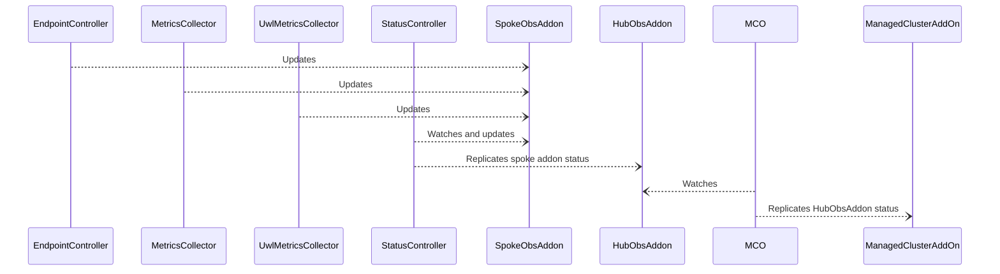
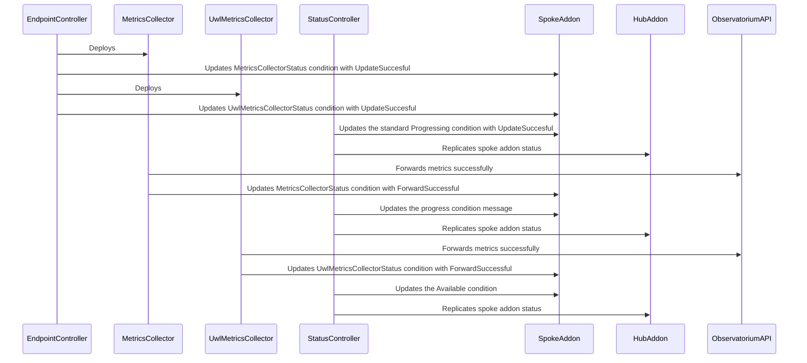
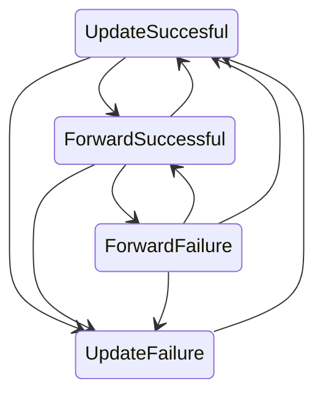

# Design Document

## Overview

The observability addon reports its status to the hub cluster by updating the status of the local `ObservabilityAddon` Custom Resource (CR). This document describes how the status is updated by the actors and synchronized between the spoke and hub clusters.

## Status Model

The status is reported through the standard `status.Conditions` structure in the `ObservabilityAddon` CR. Each condition is defined by the following standard fields:

- **type**: The type of the condition.
- **status**: The status of the condition, which can be `True`, `False`, or `Unknown`.
- **reason**: A short, machine-readable string that gives the reason for the condition's last transition.
- **message**: A human-readable message providing details about the condition.

[Three standard types](https://open-cluster-management.io/concepts/addon#add-on-healthiness) of conditions are used to report the status of the addon:

- **Available**: The addon is available and running, including the UWL metrics collector if configured.
- **Degraded**: The addon is not working as expected. Either metrics are not being forwarded or the addon update has failed.
- **Progressing**: The addon is being installed or has been updated.

Only one of these standard types can have the `True` status at a time. They are mutually exclusive. 

Those types are supported by standard reasons explaining the reason for the condition's last transition. The reasons are defined later in this document.

## Condition List Management

The conditions are expected to be modified in place, particularly by the [ManagedClusterAddOn additionalPrinterColumns](https://github.com/open-cluster-management-io/api/blob/main/addon/v1alpha1/0000_01_addon.open-cluster-management.io_managedclusteraddons.crd.yaml#L18-L27). The hub expects only one instance of each condition in the list to display the status of the addon.

If the most recent condition is identical to the new condition, the status controller should not update the condition. This prevents unnecessary updates to the CR.

## Status Synchronization

The diagram below shows the actors involved in the status synchronization process and their high level interactions. 

The hub cluster also deploys the metrics-collector, but it does not rely on the addon feature. Thus, the addon status reporting described here does not apply for the hub cluster addon.

Ultimately, the status displyed in the hub cluster for the observability addon is the status of the **ManagedClusterAddOn** CR named **observability-controller**.

## Addon State Management

### Context

Conditions can be used as simple observations to inform about the state of the addon. In our case, however, the status is updated by three components: the metrics collector, the UWL metrics collector, and the endpoint metrics operator. Without **strict transition rules** between status states, we risk **flapping states**:

- If the operator fails to update the collector, the status will degrade. However, if the metrics collector continues to forward metrics simultaneously, the status will become available, leading to a back-and-forth cycle.
- Similarly, if the platform metrics collector fails to forward metrics, the status will degrade. If, in parallel, the UWL metrics collector continues to forward metrics, the status will again become available, causing a similar back-and-forth cycle.

The addon state is an aggregation of the states of the metrics collector and the UWL metrics collector. However, each collector operates independently and is unaware of the other's status. Additionally, the UWL metrics collector is optional. If the aggregated state is not properly managed, it can result in an **inconsistent state**:

- When the system starts with both collectors, the metrics collector is unaware of the UWL metrics collector. It will set the status to available if it forwards metrics. However, if the UWL metrics collector is unavailable, the status should be degraded.

### Defining the Aggregated State Accurately

To accurately reflect the aggregated state, we introduce two additional condition types specific to the collectors: **MetricsCollectorStatus** and **UwlMetricsCollectorStatus**. These conditions are updated by the metrics collector, the UWL metrics collector, and the endpoint controller. The status controller then aggregates these specific conditions to update the standard condition types of the addon status. A predicate function ensures that the status controller is not triggered by its own updates.

These special condition types store the latest reasons for the metrics collector and the UWL metrics collector. These reasons can be mapped to the standard types, which the status controller uses to update the addon status:

- **ForwardFailure** reason corresponds to **Degraded** status type.
- **ForwardSuccessful** reason corresponds to **Available** status type.
- **UpdateFailure** reason corresponds to **Degraded** status type.
- **UpdateSuccesful** reason corresponds to **Progressing** status type.

We set a priority for the reasons to ensure that the most critical reason is reflected in the aggregated state. The priority is as follows:

1. **UpdateFailure**
2. **ForwardFailure**
3. **UpdateSuccesful**
4. **ForwardSuccessful**

The aggregated state is then determined by the highest priority reason. For example, if the condition type MetricsCollectorStatus' reason is **ForwardFailure** and the condition type UwlMetricsCollectorStatus' reason is **ForwardSuccessful**, the aggregated reason is **ForwardFailure** and the aggregated type is **Degraded**.

Finally, individual state details of each collector can be explicitly set in the message field of the aggregated condition by the status controller.

Sequentially, at the boot stage with both collectors, this would result in:

Excluded solutions:

- Making the metrics collector aware of the UWL metrics collector. This approach leads to additional complexity with more reasons, more transition rules between states, and tighter coupling between the two components. Additionally, it would cause the metrics collector to restart with each configuration change of the UWL metrics collector (activation/deactivation).

### Reasons managers

The following table maps the reasons to the actors that manage them and the condition types they update:

| Condition Type \ Actor | Endpoint Operator | Status Controller | Metrics Collector | UWL Metrics Collector |
|----------------|-------------------|-------------------|-------------------|-----------------------|
| MetricsCollectorStatus | UpdateSuccesful  UpdateFailure | | ForwardSuccessful  ForwardFailure | | 
| UwlMetricsCollectorStatus | UpdateSuccesful  UpdateFailure | | | ForwardSuccessful  ForwardFailure |
| Progressing | | UpdateSuccesful | | |
| Available | | ForwardSuccessful | | |
| Degraded | Disabled   NotSupported | ForwardFailure   UpdateFailure | |

### Ensuring Consistent Individual States

At this stage, individual states are still subject to flapping, as is the aggregated state. This is especially true when the endpoint operator fails to update a collector while it is still forwarding metrics, causing the reason to flip between **UpdateFailure** and **ForwardSuccessful**. The aggregated state would then flip between **Degraded** and **Available**.

To ensure a consistent state, we apply strict transition rules between reasons. If the current reason is not compatible with the new reason/state, the transition is not allowed. For example, if the current reason for the condition type **MetricsCollectorStatus** is **UpdateFailure**, the transition to **ForwardSuccessful** is not permitted. The endpoint operator must first update the collector successfully and transition to **UpdateSuccesful** before the collector can transition to **ForwardSuccessful**.

The following state diagram illustrates the allowed transitions between reasons:

Notes:

- The transitions toward the reason **UpdateSuccesful** are only triggered when the **deployement** resource is updated or created. For example, we avoid flipping the state if only the service resource is updated, to prevent unnecessary and confusing state changes.
- To keep the state diagram readable, we have omitted **NotSupported** and **Disabled** reasons. They are directly set on the standard **Degraded** type by the endpoint operator. And in that case, there is no aggragation of atomic metric collectors states as they are not deployed. There is no restriction to transition toward these reasons. Transitions from these reasons are restricted to **UpdateSuccesful** or **UpdateFailure**. 

