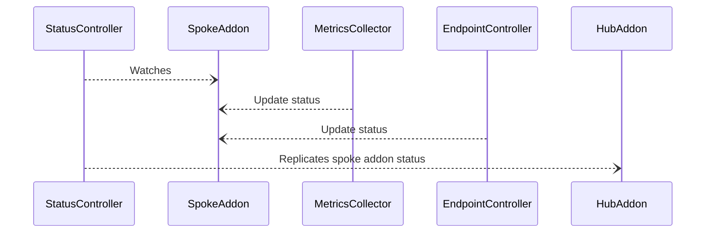
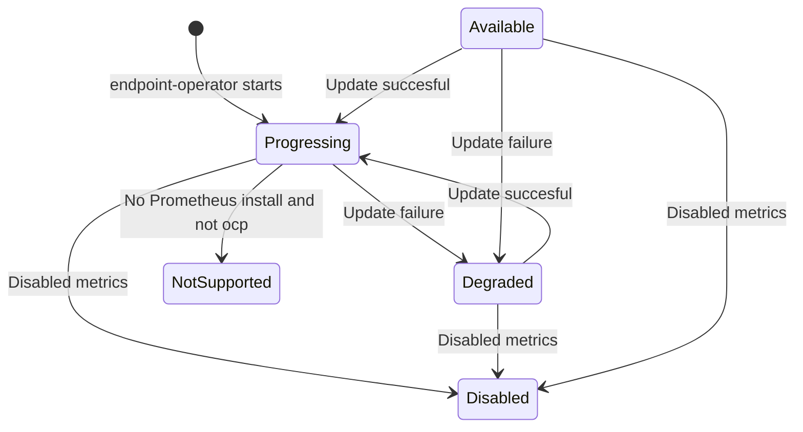
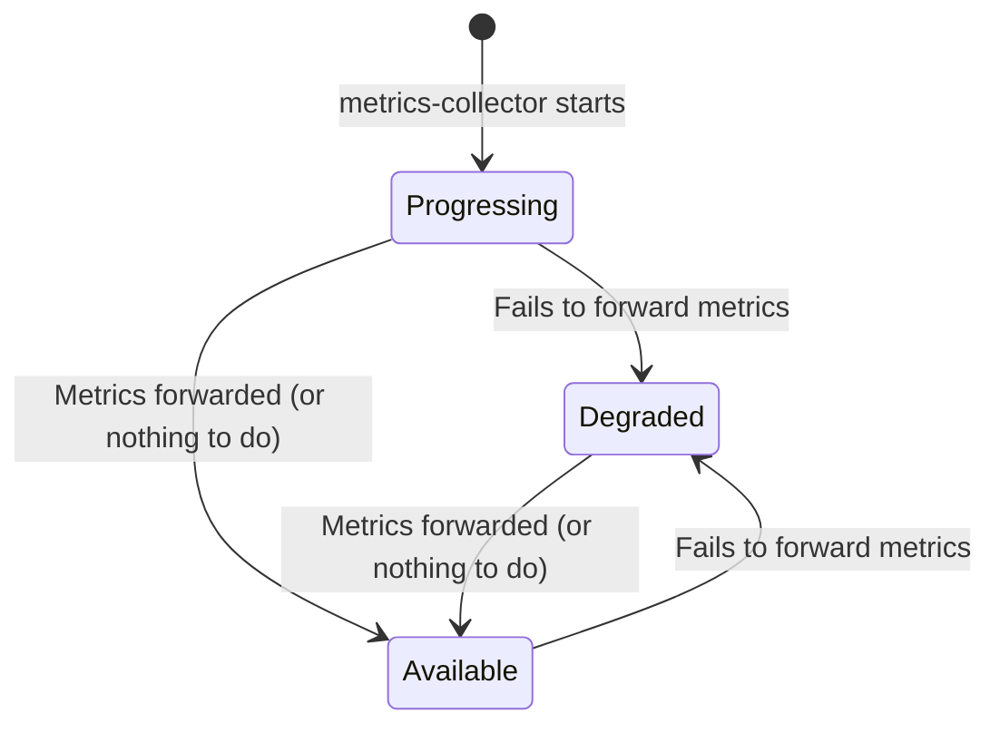

# Design Document

## Overview

The observability addon reports its status to the hub cluster by updating the status of the local `ObservabilityAddon` Custom Resource (CR). This document describes how the status is updated and synchronized between the spoke and hub clusters.

## Status Model

The status is reported through the standard `status.Conditions` structure in the `ObservabilityAddon` CR. In our case, we use the following types of conditions:

- **Available**: The addon is available and running.
- **Progressing**: The addon is being installed or updated.
- **Degraded**: The addon is not working as expected.
- **NotSupported**: The addon is not supported on the current platform.
- **Disabled**: The addon is disabled.

Each condition in the structure is defined by the following standard fields:

- **type**: The type of the condition, as described above.
- **status**: The status of the condition, which can be `True`, `False`, or `Unknown`.
- **reason**: A short, machine-readable string that gives the reason for the condition's last transition.
- **message**: A human-readable message providing details about the condition.

## Condition List Management

The list of conditions is updated by:

- **Modifying Existing Conditions**: If a condition of the same type as the most recent condition exists, it is modified. This approach is used to update the `message` field with more details or to change the `status` field.
- **Appending New Conditions**: If the type of the new condition is different from the most recent one, a new condition is appended to the list.

To prevent the list from growing indefinitely, the oldest conditions are removed if it exceeds a certain threshold. This ensures that the condition list remains manageable while preserving a history of the most recent status changes.

Using the conditions list as a history of status changes allows us to track the evolution of the status over time. This is useful for auditing and debugging purposes.

## Status synchronization

## State transitions

The hub cluster also deploys the metrics-collector, but it does not rely on the addon feature. Thus, addon status reporting does not apply for the hub cluster addon.

### Endpoint metrics operator

Open questions:

- Do we take into account the state of the other components? => No, only the metrics collector.
- Do we take into account the state of the UWL metrics collector? => No, only the main metrics collector.
  - If the UWL metrics collector is not available and the main metrics collector is still available, the reported status is Available.

### Metrics collector

Notes:

- The transition `Degraded -> Available` can only happen if the metrics-collector is responsible for the degraded state.
- The transition `Available -> Degraded` only happens if the metrics collector fails to forward metrics over a certain period of time to avoid flapping state.

### UWL metrics collector

Questions:

- Do nothing? 
- Append to the conditions list? 
  - If is able to update the state, it complexifies the logic.
