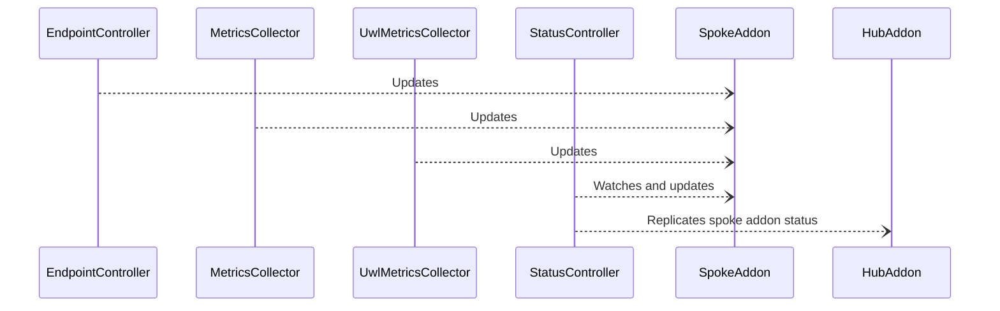
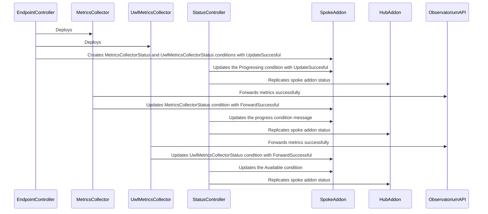
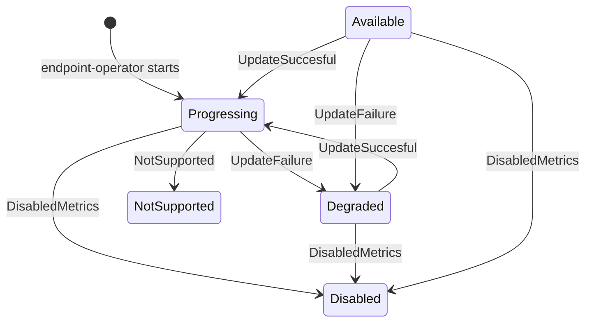
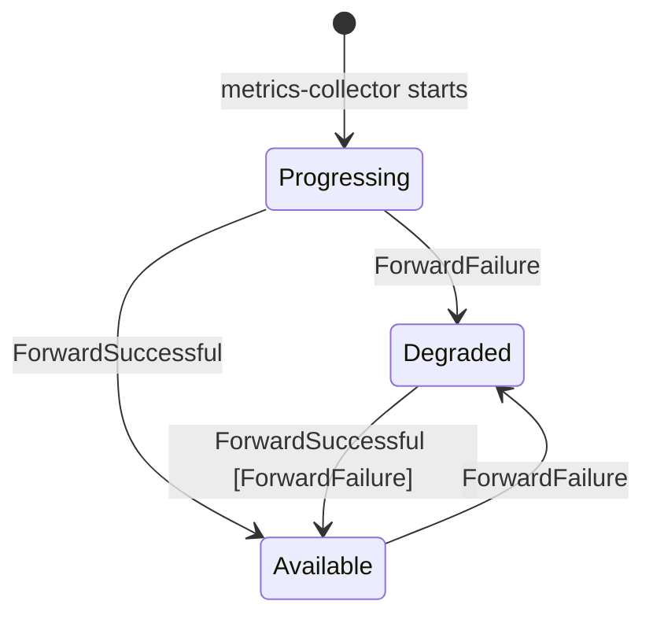

# Design Document

## Overview

The observability addon reports its status to the hub cluster by updating the status of the local `ObservabilityAddon` Custom Resource (CR). This document describes how the status is updated by the actors and synchronized between the spoke and hub clusters.

## Status Model

The status is reported through the standard `status.Conditions` structure in the `ObservabilityAddon` CR. Each condition is defined by the following standard fields:

- **type**: The type of the condition.
- **status**: The status of the condition, which can be `True`, `False`, or `Unknown`.
- **reason**: A short, machine-readable string that gives the reason for the condition's last transition.
- **message**: A human-readable message providing details about the condition.

In our case, we use the following types of conditions:

- **Available**: The addon is available and running, including the UWL metrics collector if configured.
- **Degraded**: The addon is not working as expected. Either metrics are not being forwarded or the addon update has failed.
- **Disabled**: The addon is disabled.
- **NotSupported**: The addon is not supported on the current platform. This happens when prometheus is not being installed but the cluster is not OCP.
- **Progressing**: The addon is being installed or has been updated.

Finally, the types can be associated to the following reasons:

- **DisabledMetrics**: The metrics collector is disabled. It leads to the `Disabled` status. 
- **ForwardFailure**: The metrics collector failed to forward metrics. It leads to the `Degraded` status.
- **ForwardSuccessful**: The metrics collector successfully forwarded metrics. It leads to the `Available` status.
- **NotSupported**: The platform is not supported. It leads to the `NotSupported` status.
- **UpdateFailure**: The endpoint operator failed to update the metrics collector. It leads to the `Degraded` status.
- **UpdateSuccesful**: The endpoint operator successfully updated the metrics collector. It leads to the `Progressing` status.

## Condition List Management

The conditions are expected to be modified in place, particularly by the [ManagedClusterAddOn additionalPrinterColumns](https://github.com/open-cluster-management-io/api/blob/main/addon/v1alpha1/0000_01_addon.open-cluster-management.io_managedclusteraddons.crd.yaml#L18-L27). The hub expects only one instance of each condition in the list to display the status of the addon.

If the most recent condition is identical to the new condition, the status controller should not update the condition. This prevents unnecessary updates to the CR.

## Status Synchronization

The following diagram shows the actors involved in the status synchronization process and their high level interactions:

The hub cluster also deploys the metrics-collector, but it does not rely on the addon feature. Thus, addon status reporting does not apply for the hub cluster addon.

## Addon State Management

### Context

Conditions can be used as simple observations to inform about the state of the addon. In our case, however, the status is updated by three components: the metrics collector, the UWL metrics collector, and the endpoint metrics operator. Without **strict transition rules** between status states, we risk **flapping states**:

- If the operator fails to update the collector, the status will degrade. However, if the metrics collector continues to forward metrics simultaneously, the status will become available, leading to a back-and-forth cycle.
- Similarly, if the platform metrics collector fails to forward metrics, the status will degrade. If, in parallel, the UWL metrics collector continues to forward metrics, the status will again become available, causing a similar back-and-forth cycle.

The addon state is an aggregation of the states of the metrics collector and the UWL metrics collector. However, each collector operates independently and is unaware of the other's status. Additionally, the UWL metrics collector is optional. If the aggregated state is not properly managed, it can result in an **inconsistent state**:

- When the system starts with both collectors, the metrics collector is unaware of the UWL metrics collector. It will set the status to available if it forwards metrics. However, if the UWL metrics collector is unavailable, the status should be degraded.

### Defining the Aggregated State Accurately

To accurately reflect the aggregated state, we introduce two additional condition types specific to the collectors: **MetricsCollectorStatus** and **UwlMetricsCollectorStatus**. These conditions are updated by the metrics collector, the UWL metrics collector, and the endpoint controller. The status controller then aggregates these specific conditions to update the standard conditions of the addon status. A predicate function ensures that the status controller is not triggered by its own updates.

These special condition types store the latest reasons for the metrics collector and the UWL metrics collector. These reasons can be mapped to the standard types, which the status controller uses to update the addon status.

In this context, we ignore the **Disabled** and **NotSupported** states, which are set solely by the endpoint operator and do not require aggregation.

Below are the individual reasons for the metrics collector and the UWL metrics collector, along with the resulting aggregated reasons:

| Reasons                  | ForwardFailure | ForwardSuccessful | UpdateFailure | UpdateSuccesful | 
|--------------------------|----------------|--------------|-------------------|-------------------|
| ForwardFailure           | ForwardFailure | x | x    | x    | 
| ForwardSuccessful        | ForwardFailure | ForwardSuccessful | x    | x    |
| UpdateFailure            | ForwardFailure | UpdateFailure | UpdateFailure    | x    |
| UpdateSuccesful          | ForwardFailure | UpdateSuccesful | UpdateFailure    | UpdateSuccesful    |

Then, the aggregated reasons are mapped to the standard types:

- **ForwardFailure** reason corresponds to **Degraded** status type.
- **ForwardSuccessful** reason corresponds to **Available** status type.
- **UpdateFailure** reason corresponds to **Degraded** status type.
- **UpdateSuccesful** reason corresponds to **Progressing** status type.

Finally, individual state details of each collector can be explicitly set in the message field of the aggregated condition.

Sequentially, at the boot stage with both collectors, this would result in:

Excluded solutions:

- Making the metrics collector aware of the UWL metrics collector. This approach leads to additional complexity with more reasons, more transition rules between states, and tighter coupling between the two components. Additionally, it would cause the metrics collector to restart with each configuration change of the UWL metrics collector (activation/deactivation).

### Ensuring Consistent Individual States

At this stage, individual states are still subject to flapping, as is the aggregated state. This is especially true when the endpoint operator fails to update a collector while it is still forwarding metrics, causing the state to flip between **Degraded** and **Available**.

To ensure a consistent state, we apply strict transition rules between states. Transitioning to a new state requires verifying the reason for the current state. If the reason is not compatible with the new reason/state, the transition is not allowed. For example, if the reason for the current state is **Degraded** due to **UpdateFailure**, the transition to **Available** is not permitted. The endpoint operator must first update the collector successfully and transition to **Progressing** with **UpdateSuccesful** before the collector can transition to **Available** with **ForwardSuccessful**.

This is illustrated in the state diagrams below with following notations:

- Reasons for the transitions are the edges.
- States are the nodes.
- When a transition is only possible under certain conditions, the condition is in square brackets. e.g. `UpdateSuccesful [UpdateFailure]` means that the transition is only possible if the reason for the preceding transition is `UpdateFailure`.

### Endpoint metrics operator

Notes:

- The transition `Available -> Progressing` is only triggered when the **deployement** resource is updated or created. For example, we avoid flipping the state if only the service resource is updated, to prevent unnecessary and confusing state changes.
- To keep the state diagram readable, we have omitted unlocking transitions from the supposed final state `NotSupported` to  `Disabled`, `Progressing` and `Degraded`. In practice, this state may transition if the cluster type is incorrectly identified and subsequently fixed. Also transitions from `Disabled` to `Progressing` or `Degraded` are omitted for the same reason.

### Both Metrics collectors

Notes:

- The transition `Degraded -> Available` can only happen if the metrics collector is responsible for the degraded state, i.e. the reason for the degraded state is `ForwardFailure`.
- The transition `Available -> Degraded` only happens if the metrics collector fails to forward metrics over a certain period of time to avoid flapping state.
