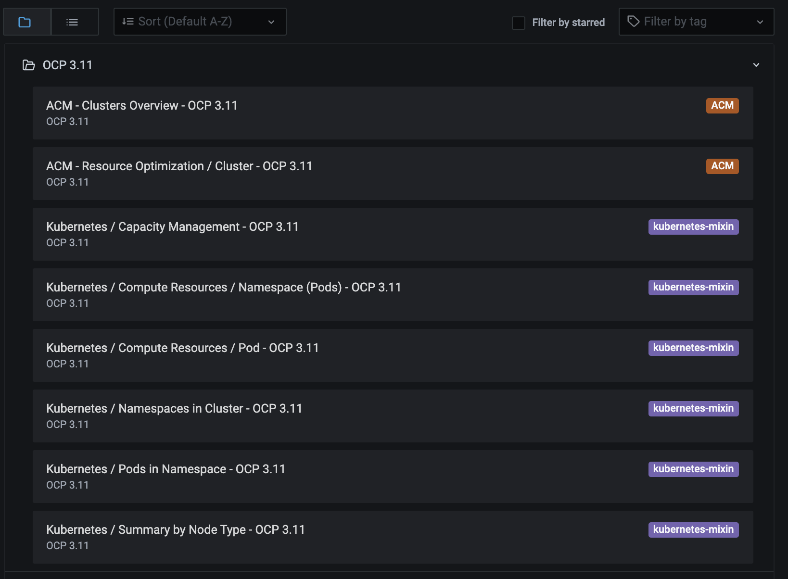

# Import Grafana Dashboards for OCP 3.11 clusters

## Prequisites

- [oc](https://docs.openshift.com/container-platform/4.7/cli_reference/openshift_cli/getting-started-cli.html)
- [jq](https://stedolan.github.io/jq/)
- [gojsontoyaml](https://github.com/brancz/gojsontoyaml)

## Getting started

1. Login to ACM cluster via oc command line.

2. Clone the repository and check out the multicluster-observability-operator repository.

```bash
git clone git@github.com:stolostron/multicluster-observability-operator.git
cd multicluster-observability-operator
```

3. Create Configmap that contains the custom metrics allow list:

```bash
curl -L https://raw.githubusercontent.com/open-cluster-management/multicluster-observability-operator/main/operators/multiclusterobservability/manifests/base/config/metrics_allowlist.yaml | gojsontoyaml --yamltojson | jq -r '.data."ocp311_metrics_list.yaml"' > /tmp/ocp311_metrics_list.yaml
oc -n open-cluster-management-observability create configmap observability-metrics-custom-allowlist --from-file=metrics_list.yaml=/tmp/ocp311_metrics_list.yaml
```

4. Load the OCP 3.11 dashboards:

```bash
find ./operators/multiclusterobservability/manifests/base/grafana -name "*-ocp311.yaml" -exec sed -i 's/clusterType=\\"ocp3\\",//g' {} \;
find ./operators/multiclusterobservability/manifests/base/grafana -name "*-ocp311.yaml" -exec sed -i 's/clusterType=\\"ocp3\\"//g' {} \;
find ./operators/multiclusterobservability/manifests/base/grafana -name "*-ocp311.yaml" -exec sed -i '/namespace:/a\ \ labels:' {} \;
find ./operators/multiclusterobservability/manifests/base/grafana -name "*-ocp311.yaml" -exec sed -i '/labels:/a\ \ \ \ grafana-custom-dashboard: "true"' {} \;
find ./operators/multiclusterobservability/manifests/base/grafana -name "*-ocp311.yaml" -exec oc apply -n open-cluster-management-observability -f {} \;
```

> _Note_: If you are running above command at MacOS, please replace `sed` with [GNU sed](https://www.gnu.org/software/sed/).

5. Then open the Grafana console and switch to dashboards page, you should see the dashboards for OCP 3.11 clusters are under `OCP 3.11` folder:


